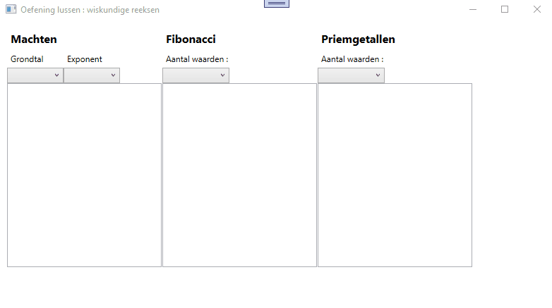

# Lussen en collecties : oefening 5 

Nadat je de code hebt binnengehaald bestudeer je eerst even de controls die zich op het venster bevinden zodat je weet welke controls er zijn en hoe ze heten.  

Vooraleer je begint te programmeren, bekijk aandachtig deze korte demo : 

    
  
  * Bij opstarten vul je :  
    * cmbBaseNumber met getallen van 1 tot 20  
    * cmbExponent met getallen van 1 tot 20  
    * cmbFibonacci met getallen van 3 tot 50  
    * cmbPrimNumber met getallen 1 tot 50  
  
  * Wanneer in cmbBaseNumber en/of cmbExponent een waarde wordt geselecteerd dan dienen alle machten berekend te worden van het geselecteerde grondtal tot de waarde geselecteerd in cmbExponent.  
  * Wanneer in cmbFibonacci een waarde wordt geselecteerd, dan dient in lstFibonacci evenveel “Fibonacci waarden” te verschijnen.    
    De eerst 2 waarden zijn 0 en 1. Vanaf de derde waarde dien je de reeks zelf aan te maken.     
    Ter info :  
    * Start van de reeks : 0 1 1 2 3 5 8 13 21 34 …  
    * M.a.w elk getal is de som van de 2 voorgaande  
    * Nog niet mee? Zoek even op internet  
  * Wanneer in cmbPrimNumber een waarde wordt geselecteerd, dan dienen er in lstPrimeNumber evenveel priemgetallen te verschijnen.  
    Een priemgetal is een positief geheel getal dat enkel deelbaar is door 1 en door zichzelf. 0 en 1 zijn GEEN priemgetallen, 2 is WEL een priemgetal (en het enige even).  
    Er is niet echt een methode om priemgetallen te voorspellen (met uitzondering van de zeef van Eratosthenes). Gebruik (of misbruik) gewoon de rekenkracht van je computer om dit op te lossen.    
    We kunnen je wel al volgende meegeven :  
    * Gezien we 2 hier buiten beschouwing laten mag je er van uit gaan dat geen enkel even getal een priemgetal is.   
    * Wanneer je op zoek gaat of een getal deelbaar is door een ander getal dan zichzelf of 1, dan zal dit “andere getal” sowieso kleiner moet zijn dan de helft van het oorspronkelijke getal. Bv : is 9 een priemgetal? Je hoeft zeker al niet te zoeken of het deelbaar is door 8, 7, 6 of 5. Vanaf 4 kan je beginnen zoeken :  
      * Deelbaar door 4? Neen : 9 is nog steeds een kandidaat.  
      * Deelbaar door 3? Ja: 9 is geen priemgetal. Ga door naar de volgende.  
